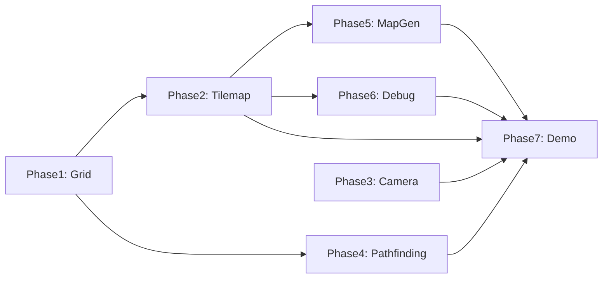

# Isometric and Grid Game System -- Technical Proposal

> **Engine:** GameFoo (`src/`)
> **Target:** Pixel-art isometric and orthogonal grid-based games
> **Architecture:** Composition-first -- Behaviours, SubSystems, and utility classes

---

## Table of Contents

1. [Executive Summary](#1-executive-summary)
2. [Current Engine Audit](#2-current-engine-audit)
3. [Grid System](#3-grid-system)
4. [Isometric Projection](#4-isometric-projection)
5. [Tilemap System](#5-tilemap-system)
6. [Camera Enhancements](#6-camera-enhancements)
7. [Pathfinding](#7-pathfinding)
8. [Procedural Map Generation](#8-procedural-map-generation)
9. [Debug Tools](#9-debug-tools)
10. [Pixel-Art Rendering Notes](#10-pixel-art-rendering-notes)
11. [Full Usage Example](#11-full-usage-example)
12. [Implementation Phases](#12-implementation-phases)
13. [File Structure Summary](#13-file-structure-summary)

---

## 1. Executive Summary

This proposal describes a set of composable modules that add **grid-based** and **isometric** game capabilities to the GameFoo engine. The goal is to support:

- Orthogonal (top-down) and isometric tile-based worlds with a shared `Grid` abstraction.
- Configurable isometric projection angle -- from aggressive (steep) to shallow (classic 2:1).
- Multi-layer tilemaps with sprite-based tiles, collision layers, and depth-sorted rendering.
- A* pathfinding over the grid with a `PathFollower` behaviour for entity movement.
- Perlin-noise-driven procedural map/level generation using the existing `PerlinNoise` utility.
- Camera enhancements: zoom, smooth follow, and projection-aware scrolling.
- A suite of opt-in debug tools: grid overlay, pathfinding visualiser, collision bounds, tile inspector, and coordinate readout.

Every new piece follows the engine's existing patterns:


| Pattern           | How we use it                                                                                                                              |
| ----------------- | ------------------------------------------------------------------------------------------------------------------------------------------ |
| **SubSystem**     | `TilemapSystem`, `GridDebugSystem` plug into `engine.use()`                                                                                |
| **Behaviour**     | `PathFollower`, `GridSnap` attach to entities                                                                                              |
| **Utility class** | `Grid`, `IsometricProjection`, `Pathfinder`, `MapGenerator` are plain classes                                                              |
| **Existing code** | `Camera`, `CameraSystem`, `PerlinNoise`, `Sprite`, `Entity`, `World`, `Collidable` stay unchanged; we extend only where strictly necessary |


Nothing is added unless it is needed. Every module is opt-in.

---

## 2. Current Engine Audit

A summary of what the engine already provides and how this proposal reuses each piece.

### 2.1 Reusable As-Is


| Module                     | File                                            | Role in this proposal                                                     |
| -------------------------- | ----------------------------------------------- | ------------------------------------------------------------------------- |
| `Camera`                   | `src/core/camera.ts`                            | Base for enhanced camera (zoom, lerp). We subclass or wrap -- not modify. |
| `CameraSystem`             | `src/subsystems/camera_system.ts`               | Reference pattern for the new `IsometricCameraSystem`.                    |
| `PerlinNoise`              | `src/core/utils/perlin_noise.ts`                | Drives `MapGenerator` -- no changes needed.                               |
| `Sprite`                   | `src/core/sprite.ts`                            | `TileSet` wraps `Sprite` for tile frame lookups.                          |
| `Entity` / `DynamicEntity` | `src/entities/entity.ts`, `dynamic_entity.ts`   | Game objects on the grid.                                                 |
| `Behaviour`                | `src/core/behaviour.ts`                         | Base for `PathFollower`, `GridSnap`.                                      |
| `World` / `Collidable`     | `src/core/world.ts`, `behaviours/collidable.ts` | Collision tiles register as fixed `Collidable` instances.                 |
| `SubSystem`                | `src/subsystems/types.ts`                       | Interface for `TilemapSystem`, `GridDebugSystem`.                         |
| `ObjectSystem`             | `src/subsystems/object_system.ts`               | Manages entity update/render; unchanged.                                  |
| `Input`                    | `src/core/input.ts`                             | Mouse/keyboard polling for debug inspector.                               |
| `MonitorSystem`            | `src/subsystems/monitor_system.ts`              | Pattern reference for debug overlays.                                     |


### 2.2 What's Missing (This Proposal Adds)


| Gap                         | New module                                         |
| --------------------------- | -------------------------------------------------- |
| No grid abstraction         | `Grid` class                                       |
| No coordinate projection    | `IsometricProjection` utility                      |
| No tilemap                  | `TileSet`, `TileLayer`, `TileMap`, `TilemapSystem` |
| No zoom / smooth follow     | `EnhancedCamera` extending `Camera`                |
| No pathfinding              | `Pathfinder` (A*) + `PathFollower` behaviour       |
| No procedural level builder | `MapGenerator` (wraps `PerlinNoise`)               |
| No grid/iso debug views     | `GridDebugSystem` subsystem                        |


---

## 3. Grid System

**Location:** `src/core/grid/grid.ts`

The `Grid` is a projection-agnostic 2D data structure. It stores cells and answers spatial queries. It does **not** know how to draw itself or what projection is used -- that is the job of the projection utilities and the tilemap renderer.

### 3.1 Types

```ts
interface GridCell<T = number> {
  col: number;
  row: number;
  value: T;
  walkable: boolean;
}

interface GridConfig {
  cols: number;
  rows: number;
  cellWidth: number;
  cellHeight: number;
  origin?: Vector2;        // world-space offset of (0,0), defaults {x:0, y:0}
}
```

### 3.2 Grid Class

```ts
class Grid<T = number> {
  readonly cols: number;
  readonly rows: number;
  readonly cellWidth: number;
  readonly cellHeight: number;
  readonly origin: Vector2;

  private cells: GridCell<T>[][];

  constructor(config: GridConfig, defaultValue: T);

  // --- Cell access ---
  getCell(col: number, row: number): GridCell<T> | undefined;
  setCell(col: number, row: number, value: T): void;
  setWalkable(col: number, row: number, walkable: boolean): void;
  isInBounds(col: number, row: number): boolean;

  // --- Coordinate conversion (orthogonal, world-space) ---
  cellToWorld(col: number, row: number): Vector2;
  worldToCell(wx: number, wy: number): { col: number; row: number };

  // --- Iteration ---
  forEach(callback: (cell: GridCell<T>, col: number, row: number) => void): void;
  getNeighbours(col: number, row: number, includeDiagonals?: boolean): GridCell<T>[];

  // --- Bulk ---
  fill(value: T): void;
  fillRect(col: number, row: number, w: number, h: number, value: T): void;
}
```

### 3.3 Coordinate Spaces

Three coordinate spaces are used throughout the system:

```
Grid Space          World Space              Screen Space
(col, row)    --->  (worldX, worldY)   --->  (screenX, screenY)
integer indices     pixel positions          canvas pixel positions
                    (cellWidth * col)        (after camera transform)
```

For **orthogonal** grids, world-space conversion is straightforward:

```ts
// Grid -> World (orthogonal)
worldX = origin.x + col * cellWidth;
worldY = origin.y + row * cellHeight;

// World -> Grid (orthogonal)
col = Math.floor((worldX - origin.x) / cellWidth);
row = Math.floor((worldY - origin.y) / cellHeight);
```

For **isometric** grids, the projection utility (Section 4) transforms between world and screen space.

---

## 4. Isometric Projection

**Location:** `src/core/grid/isometric.ts`

This is a stateless utility that converts between grid coordinates and screen coordinates using a configurable isometric angle.

### 4.1 The Math

Classic isometric projection uses a **2:1 width-to-height** ratio (tile width is twice the tile height). By making the ratio configurable, we control how "aggressive" (steep) or "flat" (shallow) the view looks.

```
Given:
  tileWidth  = W  (e.g. 64)
  tileHeight = H  (e.g. 32 for classic 2:1, 48 for steeper)

Grid-to-Screen (diamond layout):
  screenX = (col - row) * (W / 2)
  screenY = (col + row) * (H / 2)

Screen-to-Grid (inverse):
  col = Math.floor((screenX / (W/2) + screenY / (H/2)) / 2)
  row = Math.floor((screenY / (H/2) - screenX / (W/2)) / 2)
```

### 4.2 Angle Ratio Explained

The ratio `tileWidth / tileHeight` controls the perceived camera angle:


| Ratio  | tileWidth | tileHeight | Feel                                |
| ------ | --------- | ---------- | ----------------------------------- |
| 4:1    | 64        | 16         | Very flat, almost top-down          |
| 2:1    | 64        | 32         | **Classic isometric** (most common) |
| 1.33:1 | 64        | 48         | Steep / aggressive -- more "3D"     |
| 1:1    | 64        | 64         | 45-degree diamond (extreme)         |


Changing this ratio does not require any code changes -- you just pass different `tileWidth` / `tileHeight` values when constructing the projection.

### 4.3 IsometricProjection Class

```ts
interface IsoConfig {
  tileWidth: number;
  tileHeight: number;
  origin?: Vector2;        // screen-space offset for centering
}

class IsometricProjection {
  readonly tileWidth: number;
  readonly tileHeight: number;
  readonly origin: Vector2;

  constructor(config: IsoConfig);

  // Grid (col, row) -> Screen pixel position (top of diamond)
  gridToScreen(col: number, row: number): Vector2;

  // Screen pixel -> Grid (col, row) -- returns fractional, caller floors
  screenToGrid(screenX: number, screenY: number): { col: number; row: number };

  // Convenience: snap a screen point to the nearest grid cell
  snapToGrid(screenX: number, screenY: number): { col: number; row: number };

  // Get the 4 corner points of a tile diamond (for debug drawing)
  getTileDiamond(col: number, row: number): Vector2[];

  // Calculate visible grid range from a viewport rect (for culling)
  getVisibleRange(
    viewX: number,
    viewY: number,
    viewW: number,
    viewH: number
  ): { minCol: number; maxCol: number; minRow: number; maxRow: number };
}
```

### 4.4 Diamond vs Staggered Layout

The default is **diamond** layout (rotated square). For staggered (offset rows), an alternative function set can be provided:

```ts
// Staggered layout variant (odd rows offset by half a tile)
gridToScreenStaggered(col: number, row: number): Vector2 {
  const x = col * this.tileWidth + (row % 2 === 1 ? this.tileWidth / 2 : 0);
  const y = row * (this.tileHeight / 2);
  return { x: x + this.origin.x, y: y + this.origin.y };
}
```

Both variants live in the same class, selected via a `layout: "diamond" | "staggered"` config option. Default is `"diamond"`.

### 4.5 Integration with Orthogonal Grids

For a top-down orthogonal game, you skip `IsometricProjection` entirely and use `Grid.cellToWorld()` / `Grid.worldToCell()` directly. The tilemap renderer accepts an optional projection; when none is provided it falls back to orthogonal rendering. This means the same `Grid`, `TileMap`, and `Pathfinder` work for both modes.

---

## 5. Tilemap System

**Location:** `src/core/tilemap/`

### 5.1 TileSet

Wraps the existing `Sprite` class to provide tile-ID-to-frame mapping.

```ts
interface TileSetConfig {
  sprite: Sprite;
  firstGid?: number;       // first global tile ID (for multi-tileset maps), default 0
  tileProperties?: Map<number, { walkable?: boolean; [key: string]: any }>;
}

class TileSet {
  readonly sprite: Sprite;
  readonly firstGid: number;
  readonly properties: Map<number, Record<string, any>>;

  constructor(config: TileSetConfig);

  // Get the Sprite frame for a tile ID
  getFrame(tileId: number): SpriteFrame | undefined;

  // Check if a tile ID belongs to this tileset
  containsTile(tileId: number): boolean;

  // Get custom properties for a tile
  getProperties(tileId: number): Record<string, any> | undefined;
}
```

Because `Sprite` already handles grid-based frame slicing (`Sprite.fromGrid`, `Sprite.fromAtlas`, `Sprite.fromAseprite`), `TileSet` is a thin adapter.

### 5.2 TileLayer

A single layer of tile data that references a `TileSet`.

```ts
interface TileLayerConfig {
  name: string;
  cols: number;
  rows: number;
  tileSet: TileSet;
  data: number[];          // flat array, row-major: data[row * cols + col]
  visible?: boolean;
  opacity?: number;
  offsetX?: number;        // pixel offset for parallax layers
  offsetY?: number;
}

class TileLayer {
  readonly name: string;
  readonly cols: number;
  readonly rows: number;
  tileSet: TileSet;
  visible: boolean;
  opacity: number;

  private data: number[];

  constructor(config: TileLayerConfig);

  getTile(col: number, row: number): number;
  setTile(col: number, row: number, tileId: number): void;

  // Render visible portion only (receives projection for iso, or null for ortho)
  render(
    ctx: CanvasRenderingContext2D,
    projection: IsometricProjection | null,
    viewport: { x: number; y: number; width: number; height: number }
  ): void;
}
```

### 5.3 TileMap

Combines a `Grid`, multiple `TileLayer` instances, optional `IsometricProjection`, and a collision integration.

```ts
interface TileMapConfig {
  grid: Grid;
  layers: TileLayer[];
  projection?: IsometricProjection;   // omit for orthogonal
  collisionLayerName?: string;        // name of the layer that defines solid tiles
}

class TileMap {
  readonly grid: Grid;
  readonly layers: TileLayer[];
  readonly projection: IsometricProjection | null;

  constructor(config: TileMapConfig);

  // Render all visible layers in order (back-to-front)
  render(ctx: CanvasRenderingContext2D, viewport: { x: number; y: number; width: number; height: number }): void;

  // Get the tile at a screen position (accounts for projection)
  getTileAtScreen(screenX: number, screenY: number, layerName: string): number;

  // Generate Collidable entities for all solid tiles and register them with a World
  buildColliders(world: World): Entity[];

  // Depth-sorted render for isometric (painters algorithm: row by row, back to front)
  private renderIsometric(ctx: CanvasRenderingContext2D, layer: TileLayer, viewport: any): void;

  // Simple left-to-right, top-to-bottom for orthogonal
  private renderOrthogonal(ctx: CanvasRenderingContext2D, layer: TileLayer, viewport: any): void;
}
```

### 5.4 Depth Sorting (Isometric)

In isometric view, tiles and entities that are "further away" (lower `row + col` sum, or lower row) must be drawn first. The tilemap renderer handles tile depth automatically by iterating rows back-to-front.

For **entities on the map**, the `TilemapSystem` sorts all renderable objects by their effective `row` before drawing:

```ts
// Sorting key for isometric depth
function isoDepthKey(entity: Entity, projection: IsometricProjection): number {
  const { col, row } = projection.screenToGrid(entity.x, entity.y);
  return row + col;  // higher = closer to camera = drawn later
}
```

### 5.5 Collision Layer Integration

The `buildColliders` method on `TileMap` iterates the designated collision layer. For every non-zero tile that has `walkable: false` in the tileset properties, it creates a static `Entity` with a `Collidable` behaviour (shape: AABB, `fixed: true`) and registers it with the existing `World`.

```ts
// Pseudocode for buildColliders
for each (col, row) in collisionLayer:
  if tile != 0 and tileSet.getProperties(tile)?.walkable === false:
    const worldPos = projection
      ? projection.gridToScreen(col, row)
      : grid.cellToWorld(col, row);

    const wall = new WallEntity(worldPos, grid.cellWidth, grid.cellHeight);
    wall.attachBehaviour(new Collidable(wall, world, {
      shape: { type: "aabb", width: grid.cellWidth, height: grid.cellHeight },
      solid: true,
      fixed: true,
      tags: new Set(["wall"]),
      collidesWith: new Set(["player", "enemy", "npc"]),
    }));

    entities.push(wall);
```

This reuses the existing `World.detect()` O(n^2) pass. For maps with many collision tiles (hundreds+), the proposal for spatial partitioning mentioned in `world.ts` comments becomes important -- but that is out of scope here.

### 5.6 TilemapSystem (SubSystem)

```ts
class TilemapSystem implements SubSystem {
  id = "tilemap";
  order = 15;  // after camera (10), before objects (20)

  private tilemap: TileMap;
  private cameraSystem: CameraSystem | null;

  constructor(tilemap: TileMap);

  init(engine: Engine): void;  // grab reference to CameraSystem if present

  render(ctx: CanvasRenderingContext2D): void {
    const viewport = this.cameraSystem
      ? this.cameraSystem.camera.getViewRect()
      : { x: 0, y: 0, width: ctx.canvas.width, height: ctx.canvas.height };

    this.tilemap.render(ctx, viewport);
  }
}
```

Order `15` ensures tiles are drawn after the camera transform (`10`) but before entities (`20`), so entities appear on top of the map.

---

## 6. Camera Enhancements

**Location:** `src/core/camera.ts` (extend), `src/subsystems/camera_system.ts` (new variant)

The existing `Camera` class is minimal: `follow()`, `moveTo()`, `getPosition()`, `getViewRect()`, `resize()`. We extend it without modifying the original.

### 6.1 EnhancedCamera

```ts
class EnhancedCamera extends Camera {
  private _zoom: number = 1;
  private lerpSpeed: number = 0.1;   // 0 = instant, 1 = no movement
  private targetPosition: Vector2 = { x: 0, y: 0 };

  get zoom(): number;
  set zoom(value: number);           // clamped to [0.25, 4]

  // Smooth follow -- call every frame instead of Camera.follow()
  smoothFollow(target: Vector2, deltaTime: number): void {
    this.targetPosition = target;
    const pos = this.getPosition();
    const newX = pos.x + (target.x - pos.x) * this.lerpSpeed;
    const newY = pos.y + (target.y - pos.y) * this.lerpSpeed;
    this.moveTo({ x: newX, y: newY });
  }

  // Overridden to account for zoom
  override getViewRect(): { x: number; y: number; width: number; height: number } {
    const base = super.getViewRect();
    return {
      x: base.x / this._zoom,
      y: base.y / this._zoom,
      width: base.width / this._zoom,
      height: base.height / this._zoom,
    };
  }

  // Convert screen-space click to world-space position
  screenToWorld(screenX: number, screenY: number): Vector2 {
    const view = this.getViewRect();
    return {
      x: view.x + screenX / this._zoom,
      y: view.y + screenY / this._zoom,
    };
  }
}
```

### 6.2 IsometricCameraSystem

A drop-in replacement for `CameraSystem` that applies zoom and integrates with `IsometricProjection`.

```ts
class IsometricCameraSystem implements SubSystem {
  id = "camera";
  order = 10;

  camera: EnhancedCamera;
  private projection: IsometricProjection | null;
  private target: () => Vector2 | null;

  constructor(
    width: number,
    height: number,
    target: () => Vector2 | null,
    projection?: IsometricProjection
  );

  update(deltaTime: number): void {
    const t = this.target();
    if (t) this.camera.smoothFollow(t, deltaTime);
  }

  preRender(ctx: CanvasRenderingContext2D): void {
    const view = this.camera.getViewRect();
    ctx.save();
    ctx.scale(this.camera.zoom, this.camera.zoom);
    ctx.translate(-view.x, -view.y);

    // Pixel-art: disable smoothing after every scale change
    ctx.imageSmoothingEnabled = false;
  }

  postRender(ctx: CanvasRenderingContext2D): void {
    ctx.restore();
  }
}
```

### 6.3 Controlling the Isometric Angle at Runtime

The "angle" is determined by `IsometricProjection.tileHeight`. To change it at runtime (e.g. a settings slider), rebuild the projection and reassign it:

```ts
function setIsometricAngle(tilemap: TileMap, cameraSystem: IsometricCameraSystem, newTileHeight: number): void {
  const newProjection = new IsometricProjection({
    tileWidth: tilemap.projection!.tileWidth,
    tileHeight: newTileHeight,
    origin: tilemap.projection!.origin,
  });

  tilemap.projection = newProjection;     // TileMap accepts reassignment
  cameraSystem.projection = newProjection;
}
```

Because the projection is a pure math object with no state, swapping it is cheap.

---

## 7. Pathfinding

**Location:** `src/core/utils/pathfinding.ts`

### 7.1 A* Algorithm

```ts
interface PathNode {
  col: number;
  row: number;
  g: number;     // cost from start
  h: number;     // heuristic to goal
  f: number;     // g + h
  parent: PathNode | null;
}

interface PathfinderConfig {
  grid: Grid;
  allowDiagonal?: boolean;         // default: false
  diagonalCost?: number;           // default: Math.SQRT2
  heuristic?: "manhattan" | "euclidean" | "chebyshev";  // default: "manhattan"
}

class Pathfinder {
  private grid: Grid;
  private allowDiagonal: boolean;
  private diagonalCost: number;
  private heuristic: (a: {col: number, row: number}, b: {col: number, row: number}) => number;

  constructor(config: PathfinderConfig);

  // Returns ordered array of {col, row} from start to goal, or null if no path
  findPath(
    startCol: number, startRow: number,
    goalCol: number, goalRow: number
  ): { col: number; row: number }[] | null;

  // Check if a cell is reachable from another
  isReachable(
    startCol: number, startRow: number,
    goalCol: number, goalRow: number
  ): boolean;
}
```

**Implementation notes:**

- Uses a binary-heap-based priority queue for the open set (O(log n) insert/extract).
- Closed set is a flat `boolean[]` array indexed by `row * cols + col` for O(1) lookup.
- Heuristics:
  - **Manhattan:** `|dx| + |dy|` -- best for 4-directional movement.
  - **Euclidean:** `sqrt(dx^2 + dy^2)` -- best for 8-directional or free movement.
  - **Chebyshev:** `max(|dx|, |dy|)` -- best for 8-directional, uniform cost.

### 7.2 A* Step-by-Step

```
1. Create start node: g=0, h=heuristic(start, goal), f=g+h
2. Push start to open set (priority queue ordered by f)
3. While open set is not empty:
   a. Pop node with lowest f
   b. If node == goal, reconstruct path via parent chain, return it
   c. Mark node as closed
   d. For each walkable neighbour of node:
      i.  If in closed set, skip
      ii. Compute tentative g = current.g + moveCost
      iii. If neighbour not in open set or tentative g < neighbour.g:
           - Set neighbour.g = tentative g
           - Set neighbour.h = heuristic(neighbour, goal)
           - Set neighbour.f = g + h
           - Set neighbour.parent = current
           - Push/update neighbour in open set
4. Return null (no path found)
```

### 7.3 PathFollower Behaviour

A `Behaviour` that makes an entity follow a computed path, cell by cell.

```ts
class PathFollower extends Behaviour<DynamicEntity> {
  readonly type = "pathfollower";

  private pathfinder: Pathfinder;
  private grid: Grid;
  private projection: IsometricProjection | null;
  private path: { col: number; row: number }[] = [];
  private currentIndex: number = 0;
  private speed: number;
  private onPathComplete?: () => void;
  private onPathBlocked?: () => void;

  constructor(
    owner: DynamicEntity,
    pathfinder: Pathfinder,
    grid: Grid,
    options?: {
      projection?: IsometricProjection;
      speed?: number;
      onPathComplete?: () => void;
      onPathBlocked?: () => void;
    }
  );

  // Compute a new path to the target cell
  moveTo(goalCol: number, goalRow: number): boolean;

  // Cancel current path
  stop(): void;

  // Called every frame by the entity
  update(deltaTime: number): void {
    if (this.path.length === 0 || this.currentIndex >= this.path.length) return;

    const target = this.path[this.currentIndex]!;
    const targetWorld = this.projection
      ? this.projection.gridToScreen(target.col, target.row)
      : this.grid.cellToWorld(target.col, target.row);

    // Move owner toward the target position
    const dx = targetWorld.x - this.owner.x;
    const dy = targetWorld.y - this.owner.y;
    const dist = Math.sqrt(dx * dx + dy * dy);

    if (dist < 2) {
      // Arrived at waypoint
      this.currentIndex++;
      if (this.currentIndex >= this.path.length) {
        this.onPathComplete?.();
      }
    } else {
      // Move toward waypoint
      const moveX = (dx / dist) * this.speed * deltaTime;
      const moveY = (dy / dist) * this.speed * deltaTime;
      this.owner.x += moveX;
      this.owner.y += moveY;
    }
  }
}
```

### 7.4 Usage

```ts
const pathfinder = new Pathfinder({
  grid: myGrid,
  allowDiagonal: true,
  heuristic: "euclidean",
});

const npc = new DynamicEntity("guard", 100, 100, 16, 16);

const follower = npc.attachBehaviour(
  new PathFollower(npc, pathfinder, myGrid, {
    projection: isoProjection,
    speed: 60,
    onPathComplete: () => console.log("Arrived!"),
  })
);

follower.moveTo(10, 5);  // walk to grid cell (10, 5)
```

---

## 8. Procedural Map Generation

**Location:** `src/core/utils/map_generator.ts`

Leverages the existing `PerlinNoise` class to generate tile data for a `Grid` and `TileLayer`.

### 8.1 MapGenerator

```ts
interface BiomeRule {
  name: string;
  tileId: number;
  minNoise: number;    // lower threshold (inclusive)
  maxNoise: number;    // upper threshold (exclusive)
  walkable: boolean;
}

interface MapGeneratorConfig {
  cols: number;
  rows: number;
  seed?: number;
  scale?: number;               // noise coordinate scale, default 0.05
  octaves?: number;             // fBm octaves, default 4
  lacunarity?: number;          // default 2
  persistence?: number;         // default 0.5
  biomes: BiomeRule[];          // must cover the full [-1, 1] range
}

class MapGenerator {
  private noise: PerlinNoise;
  private config: MapGeneratorConfig;

  constructor(config: MapGeneratorConfig);

  // Generate raw noise map (2D array of values in [-1, 1])
  generateNoiseMap(): number[][];

  // Generate tile data using biome rules
  generateTileData(): { data: number[]; walkableMap: boolean[][] };

  // Convenience: build a complete Grid + TileLayer from config
  buildLayer(tileSet: TileSet, layerName: string): { grid: Grid; layer: TileLayer };
}
```

### 8.2 Biome Rules Example

```ts
const biomes: BiomeRule[] = [
  { name: "deep_water", tileId: 0, minNoise: -1.0, maxNoise: -0.4, walkable: false },
  { name: "water",      tileId: 1, minNoise: -0.4, maxNoise: -0.1, walkable: false },
  { name: "sand",       tileId: 2, minNoise: -0.1, maxNoise:  0.0, walkable: true },
  { name: "grass",      tileId: 3, minNoise:  0.0, maxNoise:  0.4, walkable: true },
  { name: "forest",     tileId: 4, minNoise:  0.4, maxNoise:  0.7, walkable: true },
  { name: "mountain",   tileId: 5, minNoise:  0.7, maxNoise:  1.01, walkable: false },
];
```

### 8.3 Multi-Noise Layers

For richer terrain, combine multiple noise fields:

```ts
// Elevation noise
const elevation = noise.fbm(x * 0.05, y * 0.05, 4, 2, 0.5);

// Moisture noise (different seed or offset)
const moisture = moistureNoise.fbm(x * 0.03, y * 0.03, 3, 2, 0.5);

// Combine: use elevation for terrain shape, moisture for biome variation
// e.g. high elevation + low moisture = rocky desert
//      high elevation + high moisture = snowy peaks
```

The `MapGenerator` can be extended with a second noise instance and a 2D lookup table (`elevation x moisture -> biome`) for this pattern.

### 8.4 Object Scattering

Use a separate noise layer (or the same noise with different thresholds) to place objects (trees, rocks, etc.) on walkable tiles. This matches the pattern already used in `demos/endless-world/game.ts`:

```ts
const objectNoise = new PerlinNoise(137);

for (let row = 0; row < grid.rows; row++) {
  for (let col = 0; col < grid.cols; col++) {
    const cell = grid.getCell(col, row);
    if (!cell || !cell.walkable) continue;

    const n = objectNoise.fbm(col * 0.1, row * 0.1, 2, 2, 0.5);
    if (n > 0.3) {
      // Place a tree entity at this cell
    }
  }
}
```

---

## 9. Debug Tools

**Location:** `src/debug/grid_debug.ts`

All debug tools are packaged as a single opt-in `SubSystem`. Toggle individual features via flags.

### 9.1 GridDebugSystem

```ts
interface GridDebugConfig {
  grid: Grid;
  projection?: IsometricProjection;

  showGrid?: boolean;              // draw grid lines / tile diamonds
  showCoordinates?: boolean;       // show (col, row) in each cell
  showWorldCoordinates?: boolean;  // show world-space (x, y) at cursor
  showCollisionBounds?: boolean;   // render collision AABBs/circles
  showPathfinding?: boolean;       // visualise open/closed sets and path
  showTileInspector?: boolean;     // hover a tile to see its properties

  gridColor?: string;              // default: "rgba(255,255,0,0.3)"
  pathColor?: string;              // default: "rgba(0,255,0,0.8)"
  collisionColor?: string;         // default: "rgba(255,0,0,0.5)"
  fontSize?: number;               // default: 8
}

class GridDebugSystem implements SubSystem {
  id = "grid-debug";
  order = 90;  // render late, on top of everything

  private config: GridDebugConfig;
  private inspectedTile: { col: number; row: number } | null = null;
  private lastPath: { col: number; row: number }[] = [];

  constructor(config: GridDebugConfig);

  // Accept a path to visualise (called by PathFollower or manually)
  setDebugPath(path: { col: number; row: number }[]): void;

  update(deltaTime: number): void;  // track mouse position for inspector
  render(ctx: CanvasRenderingContext2D): void;

  private renderGrid(ctx: CanvasRenderingContext2D): void;
  private renderIsometricGrid(ctx: CanvasRenderingContext2D): void;
  private renderOrthogonalGrid(ctx: CanvasRenderingContext2D): void;
  private renderCoordinates(ctx: CanvasRenderingContext2D): void;
  private renderCollisionBounds(ctx: CanvasRenderingContext2D): void;
  private renderPathfinding(ctx: CanvasRenderingContext2D): void;
  private renderTileInspector(ctx: CanvasRenderingContext2D): void;
  private renderWorldCoordinates(ctx: CanvasRenderingContext2D): void;
}
```

### 9.2 Debug Features Detail

#### Grid Overlay

Draws the grid structure over the tilemap.

- **Orthogonal:** horizontal and vertical lines.
- **Isometric:** diamond outlines for each tile using `projection.getTileDiamond()`.

```ts
// Isometric diamond drawing
private renderIsometricGrid(ctx: CanvasRenderingContext2D): void {
  ctx.strokeStyle = this.config.gridColor ?? "rgba(255,255,0,0.3)";
  ctx.lineWidth = 1;

  for (let row = 0; row < this.grid.rows; row++) {
    for (let col = 0; col < this.grid.cols; col++) {
      const points = this.projection!.getTileDiamond(col, row);
      ctx.beginPath();
      ctx.moveTo(points[0].x, points[0].y);  // top
      ctx.lineTo(points[1].x, points[1].y);  // right
      ctx.lineTo(points[2].x, points[2].y);  // bottom
      ctx.lineTo(points[3].x, points[3].y);  // left
      ctx.closePath();
      ctx.stroke();
    }
  }
}
```

#### Pathfinding Visualiser

When `showPathfinding` is true and a path has been set via `setDebugPath()`:

- Draw the **final path** as a green line connecting cell centres.
- Optionally show **open set** (yellow dots) and **closed set** (red dots) if the `Pathfinder` exposes iteration data (can be added as a debug mode on `Pathfinder`).

#### Collision Bounds Display

Iterates all `Collidable` behaviours registered in `World` and draws their shapes:

- AABB: red rectangle outline.
- Circle: red circle outline.

```ts
private renderCollisionBounds(ctx: CanvasRenderingContext2D): void {
  ctx.strokeStyle = this.config.collisionColor ?? "rgba(255,0,0,0.5)";
  ctx.lineWidth = 1;

  // Requires access to World's collider set -- via engine reference or injection
  for (const collider of this.world.getColliders()) {
    const bounds = collider.getWorldBounds();
    if (collider.shape.type === "aabb") {
      ctx.strokeRect(bounds.x, bounds.y, bounds.width, bounds.height);
    } else if (collider.shape.type === "circle") {
      ctx.beginPath();
      ctx.arc(
        bounds.x + collider.shape.radius,
        bounds.y + collider.shape.radius,
        collider.shape.radius,
        0, Math.PI * 2
      );
      ctx.stroke();
    }
  }
}
```

> **Note:** The `World` class currently keeps `colliders` as a private `Set`. To support debug rendering, add a `getColliders(): ReadonlySet<Collidable>` method. This is the only change to existing code proposed in this document.

#### Tile Inspector

When the mouse hovers over a tile:

- Highlight the tile with a semi-transparent overlay.
- Draw a tooltip showing: tile ID, (col, row), walkable status, custom properties.

```ts
private renderTileInspector(ctx: CanvasRenderingContext2D): void {
  if (!this.inspectedTile) return;
  const { col, row } = this.inspectedTile;
  const cell = this.grid.getCell(col, row);
  if (!cell) return;

  // Highlight
  const pos = this.projection
    ? this.projection.gridToScreen(col, row)
    : this.grid.cellToWorld(col, row);

  ctx.fillStyle = "rgba(255,255,255,0.2)";
  ctx.fillRect(pos.x, pos.y, this.grid.cellWidth, this.grid.cellHeight);

  // Tooltip
  const text = `(${col},${row}) id:${cell.value} ${cell.walkable ? "walk" : "solid"}`;
  ctx.fillStyle = "#fff";
  ctx.font = `${this.config.fontSize ?? 8}px monospace`;
  ctx.fillText(text, pos.x, pos.y - 4);
}
```

#### Coordinate Display

Shows a permanent readout at a fixed screen position (top-left corner) with:

- **Grid coords** of the cell under the cursor.
- **World coords** of the cursor.
- **Screen coords** (raw canvas pixel position).

### 9.3 Enabling Debug

```ts
engine.use(new GridDebugSystem({
  grid: myGrid,
  projection: isoProjection,
  showGrid: true,
  showPathfinding: true,
  showCollisionBounds: true,
  showTileInspector: true,
  showWorldCoordinates: true,
}));
```

To disable at runtime:

```ts
const debugSystem = engine.getSubSystem("grid-debug");
debugSystem.enabled = false;  // turns off all debug rendering
```

> **Note:** `engine.getSubSystem(id)` does not exist today. An alternative is to keep a reference to the system before calling `engine.use()`. If a getter is desired, it would be a small addition to `Engine` (one method, ~3 lines). This is optional.

---

## 10. Pixel-Art Rendering Notes

The engine already applies `image-rendering: pixelated` and `crisp-edges` on the canvas element (see `Engine` constructor). Additional considerations:

1. `**imageSmoothingEnabled = false`** -- must be set on the context after every `ctx.save()/restore()` cycle and after zoom changes. The `IsometricCameraSystem.preRender()` handles this.
2. **Integer coordinates** -- for crisp pixel art, round entity positions to integers before drawing:
  ```ts
   ctx.drawImage(image, sx, sy, sw, sh, Math.round(dx), Math.round(dy), dw, dh);
  ```
   The `GridSnap` behaviour (below) helps keep entities aligned to whole pixels.
3. **Tile sizes should be powers of 2** -- 8x8, 16x16, 32x32, 64x64. This keeps UV mapping clean and avoids sub-pixel artifacts.
4. **Zoom levels** -- for pixel-perfect zoom, restrict to integer multiples: 1x, 2x, 3x, 4x. The `EnhancedCamera` can enforce this with a `pixelPerfect` flag.

### 10.1 GridSnap Behaviour (Optional)

A simple behaviour that snaps entity positions to the nearest pixel or grid cell:

```ts
class GridSnap extends Behaviour<Entity> {
  readonly type = "gridsnap";
  private snapToPixel: boolean;
  private snapToCell: boolean;
  private grid: Grid;

  constructor(owner: Entity, grid: Grid, options?: { snapToPixel?: boolean; snapToCell?: boolean });

  update(_deltaTime: number): void {
    if (this.snapToCell) {
      const { col, row } = this.grid.worldToCell(this.owner.x, this.owner.y);
      const snapped = this.grid.cellToWorld(col, row);
      this.owner.x = snapped.x;
      this.owner.y = snapped.y;
    } else if (this.snapToPixel) {
      this.owner.x = Math.round(this.owner.x);
      this.owner.y = Math.round(this.owner.y);
    }
  }
}
```

---

## 11. Full Usage Example

A complete isometric demo showing all pieces working together.

### 11.1 Project Setup

```
demos/isometric/
  index.html
  game.ts
  assets/
    tileset.png      (64x32 isometric tiles)
```

### 11.2 HTML

```html
<html>
  <head>
    <style>
      body { margin: 0; background: #111; display: flex; justify-content: center; align-items: center; height: 100vh; }
      canvas { image-rendering: pixelated; }
    </style>
  </head>
  <body>
    <canvas id="game"></canvas>
    <script type="module" src="./game.ts"></script>
  </body>
</html>
```

### 11.3 Game Code

```ts
import {
  Engine, Asset, Sprite, Player, DynamicEntity,
  World, Collidable, PerlinNoise, ObjectSystem, CollisionSystem,
} from "gamefoo";

// New modules from this proposal
import { Grid } from "gamefoo/core/grid/grid";
import { IsometricProjection } from "gamefoo/core/grid/isometric";
import { TileSet, TileLayer, TileMap, TilemapSystem } from "gamefoo/core/tilemap";
import { IsometricCameraSystem } from "gamefoo/subsystems/camera_system";
import { Pathfinder } from "gamefoo/core/utils/pathfinding";
import { PathFollower } from "gamefoo/core/behaviours/path_follower";
import { MapGenerator, BiomeRule } from "gamefoo/core/utils/map_generator";
import { GridDebugSystem } from "gamefoo/debug/grid_debug";

// ──────────────────────────────────────────────
// Constants
// ──────────────────────────────────────────────
const TILE_W = 64;
const TILE_H = 32;       // classic 2:1 ratio
const MAP_COLS = 32;
const MAP_ROWS = 32;

// ──────────────────────────────────────────────
// Engine
// ──────────────────────────────────────────────
const engine = new Engine("game", 512, 384, {
  backgroundColor: "#1a1a2e",
});

// ──────────────────────────────────────────────
// Grid + Projection
// ──────────────────────────────────────────────
const grid = new Grid<number>({
  cols: MAP_COLS,
  rows: MAP_ROWS,
  cellWidth: TILE_W,
  cellHeight: TILE_H,
}, 0);

const projection = new IsometricProjection({
  tileWidth: TILE_W,
  tileHeight: TILE_H,
  origin: { x: 256, y: 32 },  // center the map on screen
});

// ──────────────────────────────────────────────
// Procedural terrain
// ──────────────────────────────────────────────
const biomes: BiomeRule[] = [
  { name: "water",    tileId: 0, minNoise: -1.0, maxNoise: -0.2, walkable: false },
  { name: "sand",     tileId: 1, minNoise: -0.2, maxNoise:  0.0, walkable: true },
  { name: "grass",    tileId: 2, minNoise:  0.0, maxNoise:  0.5, walkable: true },
  { name: "forest",   tileId: 3, minNoise:  0.5, maxNoise:  0.8, walkable: true },
  { name: "mountain", tileId: 4, minNoise:  0.8, maxNoise:  1.01, walkable: false },
];

const mapGen = new MapGenerator({
  cols: MAP_COLS,
  rows: MAP_ROWS,
  seed: 42,
  scale: 0.08,
  octaves: 4,
  biomes,
});

// ──────────────────────────────────────────────
// Build tilemap
// ──────────────────────────────────────────────
async function init() {
  const tileImage = await Asset.load("./assets/tileset.png");
  const sprite = Sprite.fromGrid(tileImage, { frameWidth: TILE_W, frameHeight: TILE_H });
  const tileSet = new TileSet({ sprite });

  const { data, walkableMap } = mapGen.generateTileData();

  // Apply walkable data to the grid
  for (let row = 0; row < MAP_ROWS; row++) {
    for (let col = 0; col < MAP_COLS; col++) {
      grid.setCell(col, row, data[row * MAP_COLS + col]!);
      grid.setWalkable(col, row, walkableMap[row]![col]!);
    }
  }

  const groundLayer = new TileLayer({
    name: "ground",
    cols: MAP_COLS,
    rows: MAP_ROWS,
    tileSet,
    data,
  });

  const tilemap = new TileMap({
    grid,
    layers: [groundLayer],
    projection,
    collisionLayerName: "ground",
  });

  // ──────────────────────────────────────────────
  // Collision
  // ──────────────────────────────────────────────
  const world = new World();
  const wallEntities = tilemap.buildColliders(world);

  // ──────────────────────────────────────────────
  // Player
  // ──────────────────────────────────────────────
  const startPos = projection.gridToScreen(5, 5);
  const player = new Player("hero", startPos.x, startPos.y, 16, 16);
  player.attachBehaviour(new Collidable(player, world, {
    shape: { type: "aabb", width: 16, height: 16 },
    solid: true,
    tags: new Set(["player"]),
    collidesWith: new Set(["wall"]),
  }));

  // ──────────────────────────────────────────────
  // NPC with pathfinding
  // ──────────────────────────────────────────────
  const pathfinder = new Pathfinder({ grid, allowDiagonal: true, heuristic: "euclidean" });

  const npc = new DynamicEntity("guard", 0, 0, 16, 16);
  const npcStart = projection.gridToScreen(10, 10);
  npc.x = npcStart.x;
  npc.y = npcStart.y;

  const follower = npc.attachBehaviour(
    new PathFollower(npc, pathfinder, grid, {
      projection,
      speed: 40,
      onPathComplete: () => {
        // Patrol: pick a random walkable cell
        const col = Math.floor(Math.random() * MAP_COLS);
        const row = Math.floor(Math.random() * MAP_ROWS);
        if (grid.getCell(col, row)?.walkable) {
          follower.moveTo(col, row);
        }
      },
    })
  );
  follower.moveTo(20, 15);

  // ──────────────────────────────────────────────
  // Subsystems
  // ──────────────────────────────────────────────
  const cameraSystem = new IsometricCameraSystem(
    512, 384,
    () => player.getPosition(),
    projection
  );

  engine.use(cameraSystem);                                       // order 10
  engine.use(new TilemapSystem(tilemap));                         // order 15
  engine.use(new ObjectSystem([player, npc, ...wallEntities]));   // order 20
  engine.use(new CollisionSystem(world));                         // order 30

  // ──────────────────────────────────────────────
  // Debug (remove in production)
  // ──────────────────────────────────────────────
  engine.use(new GridDebugSystem({
    grid,
    projection,
    showGrid: true,
    showPathfinding: true,
    showCollisionBounds: true,
    showTileInspector: true,
    showWorldCoordinates: true,
  }));

  engine.setup();
}

init();
```

### 11.4 Switching to Orthogonal

To use the same setup for a top-down game, remove the projection:

```ts
const tilemap = new TileMap({
  grid,
  layers: [groundLayer],
  // no projection = orthogonal mode
});

const cameraSystem = new CameraSystem(512, 384, () => player.getPosition());
// everything else stays the same
```

### 11.5 Changing the Isometric Angle

```ts
// Steeper / more aggressive (1.33:1 ratio)
const steepProjection = new IsometricProjection({
  tileWidth: 64,
  tileHeight: 48,
  origin: { x: 256, y: 32 },
});

// Flatter / more top-down (4:1 ratio)
const flatProjection = new IsometricProjection({
  tileWidth: 64,
  tileHeight: 16,
  origin: { x: 256, y: 32 },
});
```

---

## 12. Implementation Phases

### Phase 1 -- Grid Foundation


| Task                                                                   | New files                                       | Changes to existing |
| ---------------------------------------------------------------------- | ----------------------------------------------- | ------------------- |
| `Grid` class with cell storage, bounds checking, coordinate conversion | `src/core/grid/grid.ts`                         | None                |
| `IsometricProjection` with diamond/staggered, configurable ratio       | `src/core/grid/isometric.ts`                    | None                |
| Export from `src/index.ts`                                             | --                                              | Add exports         |
| Unit tests                                                             | `tests/grid.test.ts`, `tests/isometric.test.ts` | None                |


### Phase 2 -- Tilemap


| Task                                              | New files                            | Changes to existing |
| ------------------------------------------------- | ------------------------------------ | ------------------- |
| `TileSet` wrapping `Sprite`                       | `src/core/tilemap/tileset.ts`        | None                |
| `TileLayer` with render methods                   | `src/core/tilemap/tile_layer.ts`     | None                |
| `TileMap` with ortho/iso render, `buildColliders` | `src/core/tilemap/tilemap.ts`        | None                |
| `TilemapSystem` subsystem                         | `src/core/tilemap/tilemap_system.ts` | None                |
| Export from `src/index.ts`                        | --                                   | Add exports         |


### Phase 3 -- Camera Enhancements


| Task                                                  | New files                             | Changes to existing |
| ----------------------------------------------------- | ------------------------------------- | ------------------- |
| `EnhancedCamera` (zoom, smooth follow, screenToWorld) | `src/core/enhanced_camera.ts`         | None                |
| `IsometricCameraSystem`                               | `src/subsystems/iso_camera_system.ts` | None                |
| Export from `src/index.ts`                            | --                                    | Add exports         |


### Phase 4 -- Pathfinding


| Task                                           | New files                              | Changes to existing |
| ---------------------------------------------- | -------------------------------------- | ------------------- |
| `Pathfinder` (A* with configurable heuristics) | `src/core/utils/pathfinding.ts`        | None                |
| `PathFollower` behaviour                       | `src/core/behaviours/path_follower.ts` | None                |
| Export from `src/index.ts`                     | --                                     | Add exports         |


### Phase 5 -- Map Generation


| Task                                         | New files                         | Changes to existing |
| -------------------------------------------- | --------------------------------- | ------------------- |
| `MapGenerator` (biome rules, noise layering) | `src/core/utils/map_generator.ts` | None                |
| Export from `src/index.ts`                   | --                                | Add exports         |


### Phase 6 -- Debug Tools


| Task                                   | New files                 | Changes to existing                  |
| -------------------------------------- | ------------------------- | ------------------------------------ |
| `GridDebugSystem` (all debug overlays) | `src/debug/grid_debug.ts` | `World`: add `getColliders()` getter |
| Export from `src/index.ts`             | --                        | Add exports                          |


### Phase 7 -- Demo


| Task                                                                | New files                                                       | Changes to existing          |
| ------------------------------------------------------------------- | --------------------------------------------------------------- | ---------------------------- |
| Isometric demo with procedural map, NPC pathfinding, debug overlays | `demos/isometric/index.html`, `demos/isometric/game.ts`, assets | `demos/server.ts`: add route |


### Phase Dependencies




Phases 1, 3, and 4 can proceed in parallel since they have no mutual dependencies. Phase 2 depends on Phase 1. Phase 7 (demo) depends on all others.

---

## 13. File Structure Summary

```
src/
├── core/
│   ├── grid/
│   │   ├── grid.ts                  # Grid class (Phase 1)
│   │   └── isometric.ts            # IsometricProjection (Phase 1)
│   ├── tilemap/
│   │   ├── tileset.ts              # TileSet (Phase 2)
│   │   ├── tile_layer.ts           # TileLayer (Phase 2)
│   │   ├── tilemap.ts              # TileMap (Phase 2)
│   │   └── tilemap_system.ts       # TilemapSystem SubSystem (Phase 2)
│   ├── behaviours/
│   │   └── path_follower.ts        # PathFollower behaviour (Phase 4)
│   ├── utils/
│   │   ├── pathfinding.ts          # Pathfinder A* (Phase 4)
│   │   └── map_generator.ts        # MapGenerator (Phase 5)
│   └── enhanced_camera.ts          # EnhancedCamera (Phase 3)
├── subsystems/
│   └── iso_camera_system.ts        # IsometricCameraSystem (Phase 3)
├── debug/
│   └── grid_debug.ts               # GridDebugSystem (Phase 6)
└── index.ts                         # Updated exports

demos/
└── isometric/
    ├── index.html
    ├── game.ts
    └── assets/
        └── tileset.png
```

**Total new files:** 12 source files + 1 demo folder
**Modified existing files:** 2 (`src/index.ts` for exports, `src/core/world.ts` for `getColliders()`)